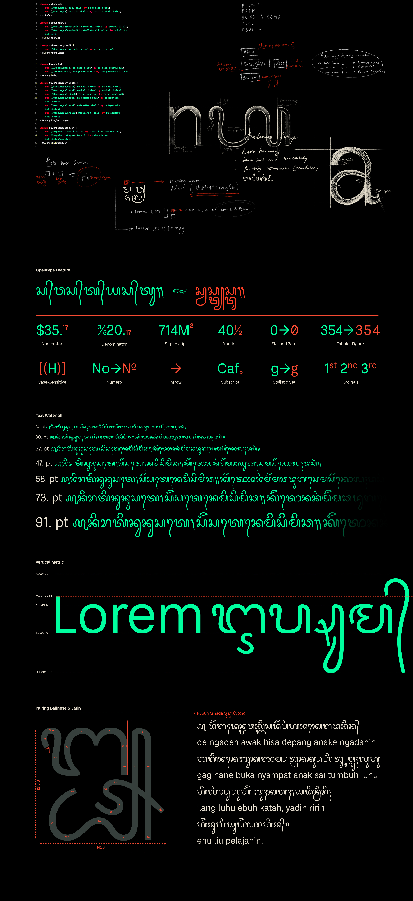

# Bali Sunaren Font
Bali Sunaren is a sans-serif typeface that harmonizes Latin and Balinese scripts in a cohesive and visually appealing way.

## 🔥 Features
- Supports **Balinese Unicode & Latin Core Glyphset**
- **Open-source (OFL License)** – Free for personal & commercial use
- Optimized for **both print and digital use**
- Includes **OpenType features** for better diacritics handling

## About

Hello! This is Balibilly Design. We’ve done some illustration and graphic design work in the past and would like to dive deeper into the world of typography and dedicate more time to it. Our team has created various typefaces that may be used under licenses and will keep developing over time as fresh and brilliant ideas arise. Because “Type is Branding,” BaliBilly Design will support you in creating designs that may be used in a variety of ways!
Typography is an artistic expression, and as a type designers, we will work tirelessly and meticulously to create the finest possible outcome for each project that is given to us because being in the design business for so many years has given us a lot of self-assurance!
Our studio is located in Canggu, one of the fastest-growing cities in Bali, surrounded by stunning features, just a short drive from Berawa Beach!

## License

This Font Software is licensed under the SIL Open Font License, Version 1.1.
This license is available with a FAQ at https://openfontlicense.org
